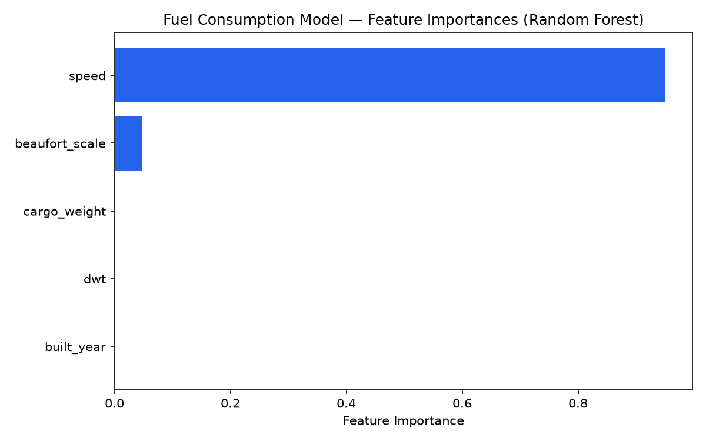
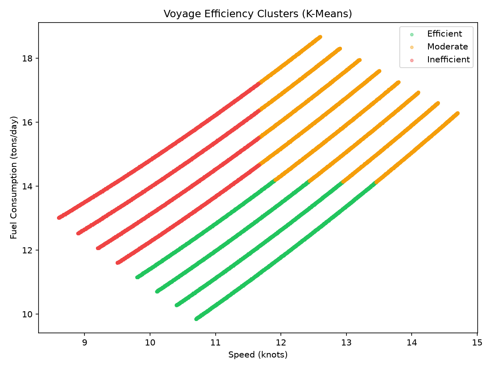
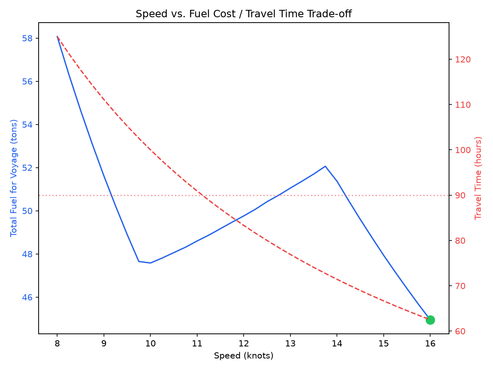
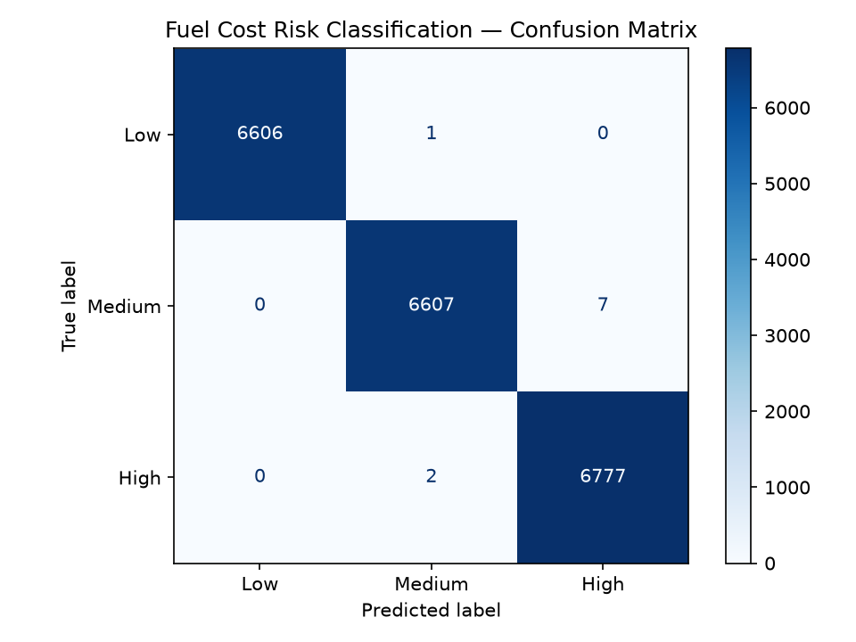
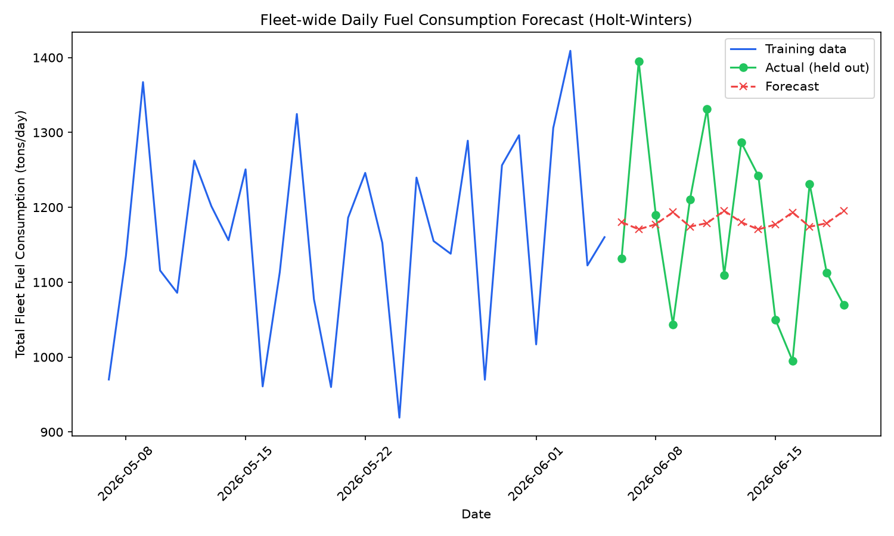

# Fuel Consumption Prediction Model

This module implements a supervised regression model that predicts vessel fuel consumption from live telemetry and vessel specification data, alongside unsupervised clustering of voyage efficiency profiles, a speed optimization recommender, a fuel-cost risk classifier, and fleet-wide time-series forecasting.

## 🎯 Problem Framing

Fuel consumption is one of the largest variable operating costs in maritime fleet management, and it is driven by a small set of measurable factors: how fast a vessel is moving, how loaded it is, how rough the weather is, and structural characteristics of the vessel itself. Framing this as a **regression problem** (predicting a continuous value — tons of fuel per day) rather than classification allows the output to plug directly into operational decision-making (e.g. voyage planning, bunker cost estimation).

## 🧮 Feature Engineering

| Feature | Source | Rationale |
|---|---|---|
| `speed` (knots) | `telemetry_logs.speed_knots` | Primary driver — fuel burn scales super-linearly with speed |
| `cargo_weight` (tons) | `telemetry_logs.cargo_weight_tons` | Higher displacement increases hull drag |
| `beaufort_scale` | `telemetry_logs.wind_beaufort` | Weather severity increases resistance and engine load |
| `dwt` (deadweight tonnage) | `vessels.capacity_dwt` | Structural capacity/size of the vessel |
| `built_year` | `vessels.year_built` | Proxy for hull efficiency and engine technology generation |

Features are pulled directly from the star-schema database via a single joined SQL query (`models/run_training.py`), keeping the training pipeline reproducible from raw telemetry to trained model with no manual data wrangling steps.

## 🌲 Model Selection: Why Random Forest Regressor

* **No feature scaling required** — unlike linear regression or SVR, tree-based models are invariant to feature magnitude, simplifying the pipeline.
* **Captures non-linear relationships** — fuel consumption scales non-linearly with speed; a Random Forest can model this without manual polynomial feature engineering.
* **Robust to outliers and noisy sensor readings** — relevant for real-world telemetry data.
* **Interpretable relative to other ensemble methods** — feature importances are directly extractable, useful for explaining predictions to non-technical stakeholders.

**Hyperparameters:** `n_estimators=100`, `random_state=42` (fixed seed for reproducibility). Not extensively tuned — a reasonable baseline given the strength of the underlying signal (see Results below); grid search over `max_depth` and `n_estimators` is a natural next step if applied to noisier, real-world data.

## 🔬 Model Comparison

Three regression algorithms were evaluated on the same train/test split to justify the model choice:

| Model | R² | RMSE (tons/day) |
|---|---|---|
| Linear Regression | 0.9741 | 0.88 |
| **Random Forest** | **0.9981** | **0.24** |
| Gradient Boosting | 0.9982 | 0.23 |

Linear Regression underperforms noticeably, confirming that the speed–fuel relationship is non-linear and better captured by tree-based ensembles. Gradient Boosting edges out Random Forest marginally (ΔR² = 0.0001), but Random Forest was retained for production serving due to faster training time and simpler hyperparameter surface — a reasonable trade-off given the negligible accuracy difference.

## 📈 Training & Evaluation

* **Dataset:** 100,000 telemetry records, joined with vessel metadata
* **Split:** 80/20 train/test, `random_state=42`
* **Metrics:**

| Metric | Value |
|---|---|
| R² (test set) | 0.9981 |
| RMSE (test set) | 0.24 tons/day |

The high R² reflects the fact that the underlying simulated telemetry follows a clean physical relationship between speed, weather, and fuel burn — a real-world production deployment would expect more noise (sensor error, unmodeled factors like currents or hull fouling) and correspondingly a lower R². The pipeline itself — feature selection, train/test methodology, and evaluation reporting — is built to the same standard regardless of the noise level of the input data.

## 🔍 Feature Importance



| Feature | Importance |
|---|---|
| speed | 0.9504 |
| beaufort_scale | 0.0483 |
| cargo_weight | 0.0012 |
| dwt | 0.0001 |
| built_year | 0.0001 |

Speed dominates the model's predictions, consistent with the physical relationship between vessel speed and fuel burn rate (fuel consumption scales super-linearly with speed). Weather severity (Beaufort scale) contributes a secondary but measurable effect, while cargo weight and vessel specifications show minimal influence in this dataset — a useful sanity check that the model has learned the expected physical relationship rather than spurious correlations.

## 🎯 Voyage Efficiency Clustering (K-Means)

Beyond predicting a single fuel consumption value, unsupervised clustering was applied to segment individual voyage records into operational efficiency profiles — useful for fleet-wide benchmarking and identifying which conditions consistently produce inefficient voyages.

* **Algorithm:** K-Means (k=3), features standardized before clustering
* **Features:** speed, fuel consumption, Beaufort scale, cargo weight
* **Silhouette Score:** 0.27

| Profile | Avg Speed | Avg Fuel (tons/day) | Avg Beaufort | Avg Cargo (tons) | Records |
|---|---|---|---|---|---|
| Efficient | 11.52 | 12.28 | 2.41 | 57,388 | 23,068 |
| Inefficient | 10.33 | 14.14 | 6.63 | 57,297 | 24,228 |
| Moderate | 12.92 | 16.14 | 4.37 | 57,842 | 27,800 |

**Interpretation:** The silhouette score of 0.27 reflects the fact that fuel consumption is a genuinely continuous function of speed and weather rather than naturally forming distinct clusters — K-Means partitions this continuum into three interpretable segments rather than discovering sharply separated groups, which is expected and reported transparently rather than overstated. The clusters remain operationally meaningful: the "Inefficient" profile is driven primarily by severe weather (Beaufort 6.63 vs 2.41 for "Efficient"), while "Moderate" reflects a speed/fuel trade-off at the highest average speed (12.92 knots) in the fleet.



## ⚙️ Speed Optimization (Recommendation + Optimization)

Using the trained fuel model as an evaluation function, this module searches over candidate cruising speeds to recommend the fuel-minimizing speed that still meets a voyage's time constraint — connecting the predictive model directly to an operational decision.

**Example scenario:** 1,000 nm voyage, must arrive within 90 hours, moderate weather (Beaufort 4).

The optimizer evaluates total fuel cost across a speed range and selects the minimum-fuel option that satisfies the time budget:



**Reproduce:**
```bash
python models/speed_optimizer.py
```

### ⚠️ Known limitation: model extrapolation beyond the training range

The recommender flagged an important limitation during testing: for speeds above ~14 knots, the model's predicted fuel rate plateaus at a constant value instead of continuing to rise. This is because the training data (`database/generate_data.py`) only contains speeds up to ~15 knots after weather adjustment — Random Forest, being a tree-based model, cannot extrapolate beyond the range of values it was trained on; it returns the nearest leaf node's value instead. As a result, the optimizer's "fastest is best" recommendation at the top of the search range is an artifact of this extrapolation limit, not a genuine physical result.

**Takeaway:** any production deployment of this optimizer would need either (a) a wider training speed range covering the full realistic operating envelope, or (b) an explicit guardrail restricting recommendations to the interpolation range the model was actually trained on. This is flagged here deliberately as an example of validating a model's outputs against its training data coverage, rather than trusting optimizer output blindly.

## 🏷️ Fuel Cost Risk Classification

The same prediction problem is reframed here as a **3-class classification task** (Low / Medium / High fuel-cost voyage) instead of predicting an exact tons/day value — useful for dashboards or alerting where a category is more actionable than a precise number.

* **Algorithm:** Random Forest Classifier
* **Labels:** Tercile-based buckets of `fuel_consumption` (Low ≤ 11.72, Medium ≤ 14.58, High > 14.58 tons/day)
* **Features:** same as the regression model (speed, cargo weight, Beaufort scale, DWT, built year)

**Results:**

| Class | Precision | Recall | F1-score |
|---|---|---|---|
| Low | 1.00 | 1.00 | 1.00 |
| Medium | 1.00 | 1.00 | 1.00 |
| High | 1.00 | 1.00 | 1.00 |
| **Accuracy** | | | **1.00** |



### ⚠️ Interpreting the perfect score honestly

A perfect classification score across every metric is a signal that deserves scrutiny rather than celebration. Here, the explanation is straightforward: the Low/Medium/High labels were derived directly from `fuel_consumption` itself (via quantile thresholds), and the classifier uses the same features that already predict `fuel_consumption` with R² = 0.998 in the regression model above. Discretizing an already near-deterministic relationship into three bins will naturally classify near-perfectly — this is an expected consequence of the label construction, not evidence of exceptional model skill or a leak-free generalization guarantee on genuinely noisy, real-world data.

**Takeaway:** in a production setting with real (noisier) sensor data and labels defined independently of the input features (e.g. actual cost thresholds set by finance, not derived from the same telemetry), this classifier would be expected to perform meaningfully below 100% — that gap would be the real measure of the model's practical value.

**Reproduce:**
```bash
python models/classify_fuel_risk.py
```

## 📉 Fleet-Wide Fuel Consumption Forecasting

Time-series forecasting was applied to fleet-wide daily fuel consumption using Holt-Winters Exponential Smoothing with weekly seasonality, evaluated with a proper **time-ordered** train/test split (the last 14 days held out — never randomly shuffled, which would leak future information into training for time-series data).

* **Method:** Holt-Winters Exponential Smoothing (additive trend + weekly seasonality)
* **Data:** 901 days of fleet-wide daily fuel totals
* **Evaluation:** last 14 days held out, compared against a naive baseline (predict "same as yesterday")

**Results:**

| Method | MAE (tons/day) |
|---|---|
| Holt-Winters forecast | 104.43 |
| Naive baseline (yesterday's value) | **98.15** |



### ⚠️ Honest finding: the forecast underperforms the naive baseline

Unlike the regression, clustering, and classification results above, this forecast **does not outperform a trivial baseline**. The root cause traces back to the synthetic data generation process (`database/generate_data.py`): telemetry dates were sampled randomly across a 60-day window rather than generated sequentially, so the daily aggregate series contains no genuine weekly seasonal pattern for Holt-Winters to learn — the model's seasonal component is effectively fitting noise, which actively hurts accuracy relative to simply repeating the last observed value.

**Takeaway:** this is reported transparently rather than hidden or reframed as a success, because comparing against a naive baseline — and being willing to report when a more sophisticated method loses to it — is itself the correct methodology. It also identifies a concrete, fixable data generation issue: a production-quality version of this pipeline would need dates generated sequentially (one row per vessel per day) rather than randomly sampled, to give any time-series method a genuine seasonal or trend signal to model.

**Reproduce:**
```bash
python models/forecast_fuel_trend.py
```

## 🔌 Serving the Model

The trained model (`fuel_model.pkl`) is loaded once at FastAPI startup (`main.py`) and served through:

```
POST /predict-fuel-consumption
```

**Request body:**
```json
{
  "speed": 12.5,
  "cargo_weight": 60000,
  "beaufort_scale": 4,
  "dwt": 105000,
  "built_year": 2018
}
```

**Response:**
```json
{
  "predicted_fuel_consumption_tons_per_day": 15.13,
  "unit": "Metric Tons / Day",
  "status": "success"
}
```

## 📁 Files in This Module

| File | Purpose |
|---|---|
| `run_training.py` | Entry point: loads data from PostgreSQL, calls `train_fuel_model` |
| `train_model.py` | Defines feature/target selection, train/test split, model fitting, and evaluation |
| `compare_models.py` | Compares Linear Regression, Random Forest, and Gradient Boosting on the same data/split |
| `feature_importance.py` | Extracts and plots feature importances from the trained model |
| `cluster_voyages.py` | K-Means clustering of voyages into efficiency profiles |
| `speed_optimizer.py` | Recommends fuel-minimizing cruising speed given a voyage distance and time budget |
| `classify_fuel_risk.py` | Random Forest classifier: Low/Medium/High fuel-cost category |
| `forecast_fuel_trend.py` | Holt-Winters time-series forecast of fleet-wide daily fuel consumption |
| `fuel_predictor.py` | Lightweight `FuelPredictor` class for loading the model and serving predictions outside of FastAPI (e.g. for testing or batch scoring) |
| `fuel_model.pkl` | Serialized trained regression model (joblib) |
| `voyage_clusters.pkl` / `voyage_scaler.pkl` | Serialized cluster model and feature scaler |
| `fuel_risk_classifier.pkl` | Serialized trained classifier |
| `feature_importance.png` | Generated feature importance chart |
| `voyage_clusters.png` | Generated cluster visualization |
| `speed_optimization.png` | Generated speed vs. fuel/time trade-off chart |
| `confusion_matrix.png` | Generated confusion matrix chart |
| `fuel_forecast.png` | Generated forecast vs. actual chart |

## 🚀 Reproducing the Results

```bash
# From the project root, with the PostgreSQL container running and seeded:
python models/run_training.py

# Optional: compare against other algorithms
python models/compare_models.py

# Optional: regenerate the feature importance chart
python models/feature_importance.py

# Optional: run voyage efficiency clustering
python models/cluster_voyages.py

# Optional: run speed optimization recommender
python models/speed_optimizer.py

# Optional: run fuel-cost risk classification
python models/classify_fuel_risk.py

# Optional: run fleet-wide fuel consumption forecasting
python models/forecast_fuel_trend.py
```

This will print the R² and RMSE on the held-out test set and overwrite `fuel_model.pkl` with a freshly trained model.