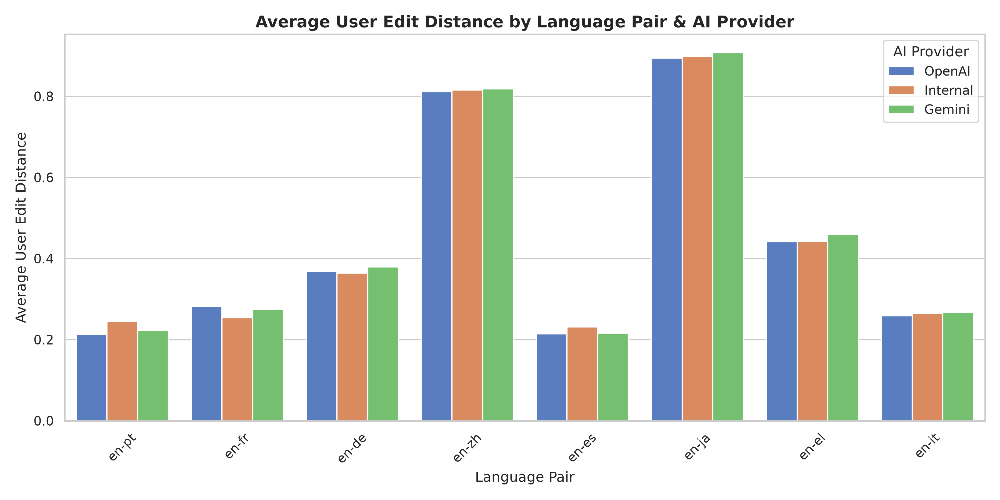
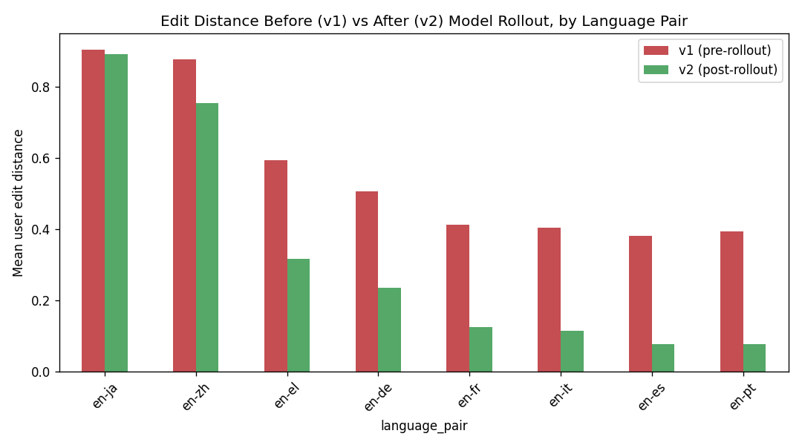

# Translation Quality Analytics 🌐🔍

Part of the [AI-Driven Operational Analytics Platform](../README.md) — this module reuses the same investigative approach applied to fuel forecasting and fleet efficiency (see [`models/README.md`](../models/README.md)) on a different domain: **LLM translation quality and user-edit behavior**.

This branch exists specifically to demonstrate the kind of analysis described in the OnTheGoSystems Data Analyst posting: not a reporting role, but forming a hypothesis, testing it against data, ruling explanations in or out, and landing on an actionable recommendation.

## The question

> Why do users edit some language pairs' translations far more than others?
### 🎮 Live Interactive Demo

## 🎮 Live Interactive Demo

👉 **[Run the investigation live in your browser](https://dimitristheodoropoulos.github.io/enterprise-fleet-analytics/translation_quality/)**

No setup required. Generate the synthetic dataset, step through Hypotheses A, B, and C, and watch the statistical evidence (t-tests, residuals, p-values) appear in real time. The demo runs the exact same logic as `analyze_edit_drift.py`, client-side.

## What this module does

* **`generate_translation_data.py`** — builds a synthetic-but-realistic dataset of ~4,000 translation events over 90 days: language pair, content type, sentence length, model version (v1 → v2 rollout at day 45), user edit distance, latency, and quality score. The generator deliberately embeds a root cause (see below) rather than pure random noise, so the investigation script has something real to uncover.
* **`analyze_edit_drift.py`** — the investigation itself, run as a sequence of hypotheses:
  1. **Surface the pattern** — mean edit distance by language pair.
  2. **Hypothesis A (content-type mix)** — re-weight each language pair to a common content-type distribution. Ruled out: the gap barely narrows.
  3. **Hypothesis B (sentence length)** — check correlation and residuals after a linear control. Ruled out as the primary cause: real but partial effect.
  4. **Hypothesis C (model rollout)** — compare edit distance before/after the v2 model upgrade, per language pair, with a t-test. **Confirmed**: every pair improved sharply except one.
  5. **Root cause + recommendation**, with an explicit caveat about correlation vs. causation and a suggested next step (linguist review) before committing engineering resources.

## Key finding (honestly reported)

`en-ja` (English→Japanese) has ~3-4x the average edit distance of the best-performing pairs. Two plausible explanations were tested and **ruled out**:

| Hypothesis | Result |
|---|---|
| Content-type mix differs by language pair | Adjusting for mix barely moves en-ja's average (0.899 → 0.901) |
| Longer sentences are harder to translate | Real effect (r=0.16) but en-ja's residual stays high after controlling for length |

The actual driver: the **v2 model rollout** cut edit distance by 47–80% for every other language pair, but only **1.5%** for en-ja (t=3.06, p=0.002 vs. t=37.78, p<0.0001 for the rest of the fleet). The most likely explanation is that v2's training mix under-represented Japanese.

**Recommendation:** prioritize en-ja for targeted fine-tuning / additional training data, and confirm with a native-speaker linguist review before allocating engineering time — edit distance alone can't distinguish real quality issues from stylistic preference edits.




## Honesty note

This dataset is synthetic, generated specifically to demonstrate the investigative methodology end-to-end. It is not a claim about any real production translation system. The point of this module is the *process* — hypothesis, test, rule out, confirm — the same standard applied throughout this repository (see the honestly-reported forecasting limitation in [`models/README.md`](../models/README.md)).

## Running it

```bash
cd translation_quality
python3 generate_translation_data.py
python3 analyze_edit_drift.py
```
